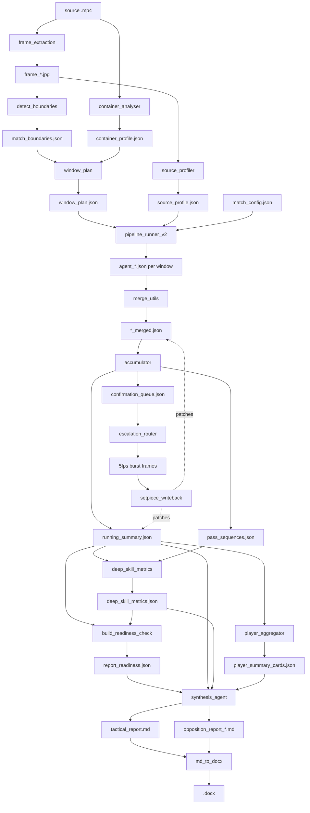

# Match Lens — Architecture

How a match video becomes a tactical report: the pipeline steps, the script that
implements each one, and the artefact each step reads and writes.

**Why this document exists.** `SKILL.md` defines 13 pipeline steps across 4,874
lines but names only 8 of the repo's 43 scripts by filename, and six of its steps
(1, 1b, 1c, 1d, 1e, 2) bind to no module at all. The step → script binding
survives mainly in module docstrings, one-directionally, and nothing points the
other way. This file supplies the missing binding so the spec and the
implementation can be checked against each other.

Generated 2026-08-12 by static analysis of all 43 Python modules (AST extraction
of every JSON read/write site) cross-referenced against `SKILL.md` and module
docstrings. No match data was available, so nothing here is derived from a run.

---

## The two halves

Match Lens is not a conventional program. It has two interlocking halves, and
most of its failure modes live at the seam between them.

| | **The agents** | **The scaffolding** |
|---|---|---|
| Defined by | `SKILL.md` (4,874 lines) | 43 Python modules (~21,900 LOC) |
| Does | looks at frames, emits findings as JSON | extracts frames, plans windows, merges, aggregates, validates, renders |
| Fails by | hallucinating, or reporting low-confidence claims as fact | dropping, mis-keying, or silently defaulting the agents' output |

The Python code is largely a **data-custody layer**: it rarely computes tactical
judgements itself, it moves agent-produced JSON between stages. So the questions
that matter for correctness are custody questions — is a value written under the
key it is read under, does a missing value stay distinguishable from a measured
one, does a merge preserve both sides.

---

## Pipeline stages

Step IDs come from module docstrings (`SKILL.md` mostly does not state them).

### Phase 1 — Preparation

| Step | Script | Reads | Writes |
|---|---|---|---|
| 1 | `frame_extraction.py`, `frame_preprocessor.py` | source `.mp4`, `match_config.json` | `frame_*.jpg`, `*_metadata.json` |
| 1a | `container_analyser.py` | video container via `ffprobe` | `container_profile.json` |
| 1b | `detect_boundaries.py` | frames, `match_config.json` | **`match_boundaries.json`** |
| 1c | `window_plan.py` | `match_boundaries.json`, `container_profile.json`, `match_config.json` | **`window_plan.json`** |
| 1d | `extract_match_details.py`, `jersey_ocr.py`, `pitch_validation.py` (helper) | teamsheet screenshot, frames | `match_config_draft.json`, `teamsheet_image_raw.json`, `jersey_number_map.json` |
| 1e | *(no Python — agent vision task)* | frames | attack direction into `match_config.json` |
| 1f | `source_profiler.py` | sampled frames, `source_profiles_config.json` | **`source_profile.json`**, `result_family_gates.json` |

`source_profile.json` is the quality contract for everything downstream: it
classifies the footage and thereby determines which tactical claims are
admissible at all (`visibility_minimums.py`, `zone_helpers.py`, `report_filter.py`
all gate on it).

### Phase 2 — Analysis

| Step | Script | Reads | Writes |
|---|---|---|---|
| 2 | `pipeline_runner_v2.py` | `match_config.json`, `window_plan.json`, `source_profile.json` | agent prompts (in-memory) |
| 3 | `pipeline_runner_v2.py` (+ `batch_runner.py`) | frames + prompts → Anthropic API | `agent_{id}_{label}_{kind}.json` per window |
| 3e | `merge_utils.py` | per-agent window outputs | `agent_{id}_{label}_merged.json` |
| 3f/3g | `accumulator.py` | `*_merged.json` | **`running_summary.json`**, `pass_sequences.json`, `confirmation_queue.json`, `shots_log.json` |
| 3d-SP | `escalation_router.py` → `frame_extraction.py` | `confirmation_queue.json`, `match_boundaries.json` | 5fps burst frames, `*_setpiece.json` |
| 3d-SP-WB | `setpiece_writeback.py` | burst outputs | patches `*_merged.json` + `running_summary.json` |
| 3i | `player_escalation_router.py` | `*_merged.json` | `player_escalation_queue.json` |
| 3h | `ground_truth.py` | `running_summary.json`, `window_plan.json` | `ground_truth_check.json` |
| 3k | `deep_skill_metrics.py` (or `build_deep_skill_metrics_v2.py`) | `running_summary.json`, `pass_sequences.json`, `result_family_gates.json` | **`deep_skill_metrics.json`** |
| — | `player_aggregator.py`, `watch_list_aggregator.py` | `running_summary.json` | `player_summary_cards.json` |

### Phase 3 — Gating and reporting

| Step | Script | Reads | Writes |
|---|---|---|---|
| gate | `build_readiness_check.py` | 10 pipeline artefacts | `report_readiness.json`, `confidence_reliability_report.json` |
| 3l | `synthesis_agent.py` | `running_summary.json`, `deep_skill_metrics.json`, `player_summary_cards.json`, `shots_log.json`, … | `tactical_report.md`, `advanced_tactical_report.md`, `opposition_report_*.md` |
| 4 | `report_filter.py` | `match_config.json` | filtered report level |
| 5 | `md_to_docx.py` | `tactical_report.md`, `opposition_report_*.md` | `.docx` |

`build_readiness_check.py` is the pipeline's gate — it reads the widest set of
artefacts (10) of any module and decides whether reporting may proceed.

### Cross-cutting modules

`pipeline_paths.py` (canonical path lookups), `pipeline_accessors.py` (canonical
field readers for keys with historical name drift), `pipeline_schemas.py`
(`schema_version` stamping), `pipeline_state.py` (checkpoint/resume),
`job_logger.py`, `cost_estimator.py`, `inspect_job_outputs.py`.

`pipeline_accessors.py` and `pipeline_paths.py` exist specifically because of past
drift incidents. **They are the correct place to add any new field or path
lookup** — bypassing them with an inline `.get()` is how drift re-enters.

---

## Artefact flow

---

## Central artefacts

### `running_summary.json` — the spine

Everything after Step 3f reads it; the reports are essentially a rendering of it.

**Four live writers**, all non-atomic (`open(path,"w")` + `json.dump`, no
write-temp-then-rename):

- `accumulator.py:812` — main accumulation
- `accumulator.py:1915` — summary update path
- `accumulator.py:1931` — **final write of the run**: persists window-label
  backfill, goal/state reconciliation and `set_piece_filter_summary`
- `setpiece_writeback.py:181` — 5fps burst corrections patched back in

Two further modules also write it and are **legacy — do not use**:
`update_running_summary_v2.py:235` and `update_running_summary_v2_1_patch.py:83`.
Both bypass `stamp_schema_version`, and the former reads the superseded
`formation.shape_in_possession` key. Nothing imports either; both are runnable
as scripts, which is the hazard.

### `match_boundaries.json` — kickoff truth

Written by `detect_boundaries.py:507/624`. The kickoff offsets exist in **two
independent representations**, and this is a live source of bugs:

| Representation | Where | Written by |
|---|---|---|
| nested `boundaries.ko_1h.seconds` | `match_boundaries.json` | `detect_boundaries.py` |
| flat `ko_1h_s`, `ko_2h_s`, `ht_s`, `ko_et1_s`, `ko_et2_s` | `match_config.json` / `window_plan.json` | **no Python writer — hand-entered by the operator** |

`pipeline_runner_v2.py:1003-1008` documents the rule: read `match_config` first,
fall back to `match_boundaries.json`. Two of the file's three reader sites do so
(`:1009-1023`, `:2221-2231`); `_match_state_at_window()` at `:858` does not — see
`AUDIT-2026-08.md` A8.

### `source_profile.json` — the admissibility contract

Written by `source_profiler.py`. Read by at least 10 modules. Determines which
tactical conclusions the footage can support; suppressing or defaulting it causes
claims to be made that the footage cannot justify.

---

## Known contract hazards

Structural properties to keep in mind when changing anything:

1. **Most JSON is agent-produced, not Python-produced.** Of 1,245 distinct dict
   keys, 158 are read by Python but never written by it — they arrive from LLM
   agents following `SKILL.md` schemas. A key can therefore be "missing" because
   the spec changed, with no Python change involved.
2. **Two naming conventions for kickoff** (above) — the most bug-dense area.
3. **Canonical accessors are optional.** `pipeline_accessors.py` centralises
   drift-prone reads, but nothing forces their use; inline `.get()` calls
   reintroduce drift silently.
4. **Filename patterns are constructed, not declared** —
   `agent_{id}_{safe_label}_{kind}.json` is built by f-string at write time and
   matched by glob at read time. `pipeline_paths.py` exists to centralise this.
5. **No dependency manifest.** Seven third-party packages, none pinned; four have
   import names that differ from their pip names (`PIL`→Pillow, `cv2`→opencv-python,
   `dotenv`→python-dotenv, `docx`→python-docx).

See `AUDIT-2026-08.md` for verified defects.

---

## Removed deliverables (2026-08)

`flagged_moments.md` and `pass_network.md` are no longer produced, and
`generate_flagged_moments.py` / `generate_pass_network.py` are deleted.

Flagged moments are now folded into the tactical and opposition reports where
they are relevant, sourced as structured records from
`running_summary.json` (`flagged_moments`, `key_moments`) rather than from a
rendered markdown file. Pass-sequence data still drives the build-up metrics in
`deep_skill_metrics.json`; only the standalone network report is gone.

This also closed a latent bug: `synthesis_agent` read `flagged_moments.md` as an
input, but `3l_synthesis` ran *before* the phase that generated it, so on a first
run the reports saw no flagged moments at all.
